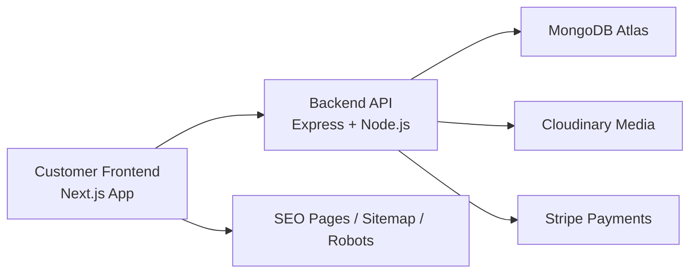

# Chic

<div align="center">

  
  
  
  
  

  <h3>Premium fashion commerce platform for modern clothing brands.</h3>

  <p>
    <a href="https://jannahchic.com">Live Storefront</a>
    ·
    <a href="https://github.com/Hoor-Fayaz/Chic">GitHub</a>
  </p>

</div>

Chic is a production-ready eCommerce platform built for premium fashion brands. It combines a modern storefront, a robust REST API, and an admin dashboard to deliver a complete online shopping experience from browsing to checkout.

The project is built with a scalable architecture and optimized for performance, search visibility, and user-friendly storefront operations.

---

## Highlights

- Premium storefront experience with responsive luxury-inspired UI
- Product catalog with filtering by category, material, size, and color
- Wishlist and cart workflows for shoppers
- Secure checkout integration with Stripe
- Admin dashboard for products, orders, reviews, and CMS content
- SEO-friendly pages with sitemap and robots configuration
- Cloud-based media handling with Cloudinary
- MongoDB Atlas backend for scalable data storage

---

## Architecture



This architecture separates the customer-facing UI from the API services, allowing for clean development, easier scaling, and better deployment flexibility.

---

## Tech Stack

### Frontend
- Next.js 14
- React
- Tailwind CSS
- Zustand
- Lucide icons
- Swiper

### Backend
- Node.js
- Express.js
- Mongoose ODM
- JWT authentication
- Passport.js (Google/Facebook OAuth support)
- Stripe API

### Data & Media
- MongoDB Atlas
- Cloudinary

### Deployment
- Vercel
- Docker Compose support

---

## Project Structure

```text
Chic/
├── backend/                     # Express API and database configuration
│   ├── src/
│   │   ├── app.js               # Express app setup and routes
│   │   └── db.js                # MongoDB connection
│   ├── .env                     # Local environment variables
│   ├── clear_and_admin.js       # Admin/database utility scripts
│   └── package.json
│
├── frontend/                    # Next.js storefront and admin UI
│   ├── app/
│   │   ├── sitemap.js          # Dynamic sitemap generation
│   │   └── robots.js           # SEO crawler rules
│   ├── components/
│   ├── .env.local              # Frontend environment config
│   └── package.json
│
├── docker-compose.yml          # Container orchestration config
├── seed-products.js            # Product seeding utility
├── README.md                   # Project documentation
├── package-lock.json           # Root lock file
├── test.js                     # Basic verification script
├── .gitignore
└── LICENSE                     # If present in your repo
```

---

## Features Overview

### Storefront Experience
- Responsive product browsing
- Category and collection pages
- Search and filtering options
- Product detail pages with images and variants
- Wishlist and cart experiences
- Fast page transitions via optimized Next.js rendering

### Admin Dashboard
- Product CRUD management
- Category management
- Inventory updates and sale pricing
- Review moderation
- CMS controls for policies and homepage content
- Order and sales visibility

### Performance & SEO
- ISR and optimized frontend rendering
- Dynamic sitemap and robots policy generation
- Vercel CDN-backed delivery
- Structured metadata support
- Proxy security and rate limiting setup

---

## Getting Started

### 1. Clone the repository

```bash
git clone https://github.com/Hoor-Fayaz/Chic.git
cd Chic
```

### 2. Set up the backend

```bash
cd backend
npm install
cp .env.example .env
```

Then configure your environment variables, including:

```env
PORT=5000
MONGO_URI=your_mongodb_connection_string
JWT_SECRET=your_jwt_secret
CLOUDINARY_CLOUD_NAME=your_cloud_name
CLOUDINARY_API_KEY=your_api_key
CLOUDINARY_API_SECRET=your_api_secret
STRIPE_SECRET_KEY=your_stripe_secret
CLIENT_URL=http://localhost:3000
```

Start the API:

```bash
npm run dev
```

### 3. Set up the frontend

```bash
cd ../frontend
npm install
```

Create or update `.env.local`:

```env
NEXT_PUBLIC_API_URL=http://localhost:5000/api/v1
```

Start the frontend:

```bash
npm run dev
```

The storefront will be available at:

```text
http://localhost:3000
```

The backend API will run at:

```text
http://localhost:5000
```

---

## Running with Docker

A Docker Compose setup is included for local orchestration:

```bash
docker-compose up --build
```

---

## Security Notes

- Never commit production secrets to GitHub
- Store API keys, database URLs, and JWT secrets in environment variables
- Keep MongoDB and Cloudinary credentials restricted to deployment environment settings
- Use secure proxy headers and rate limiting when deploying behind Vercel or production reverse proxies

---

## Deployment

This project is designed for deployment on Vercel, with the backend and frontend configured for production-ready hosting. The README and setup are structured for a smooth local development flow as well as cloud deployment.

---

## Roadmap

Possible enhancements for future iterations include:

- enhanced product recommendation engine
- advanced analytics dashboard
- loyalty and referral system
- multi-vendor support
- improved mobile checkout flow
- broader localization and currency support

---

## Contributing

Contributions are welcome. If you want to improve the platform:

1. Fork the repository
2. Create a feature branch
3. Make your changes
4. Commit and open a pull request

---

## License

This project currently follows the repository’s license configuration. Please review the project license before production or commercial deployment.

---

## Credits

Built as a premium fashion commerce platform focused on scalability, usability, and conversion-friendly storefront design.

<p align="center">
  <strong>Chic</strong> — modern shopping, crafted beautifully.
</p>

---

If you want, I can also create a more luxury-brand version of this README with a stronger product-page style, more dramatic section headers, and a more premium SaaS-like aesthetic for the GitHub landing page.